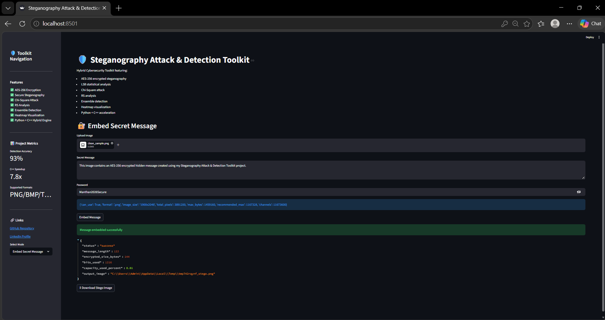
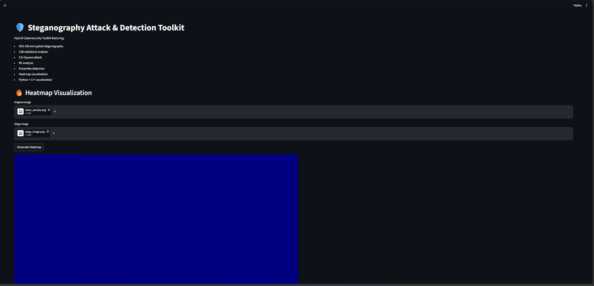
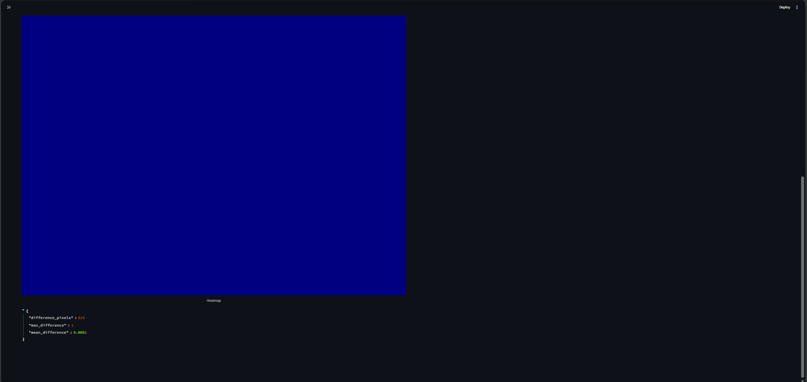
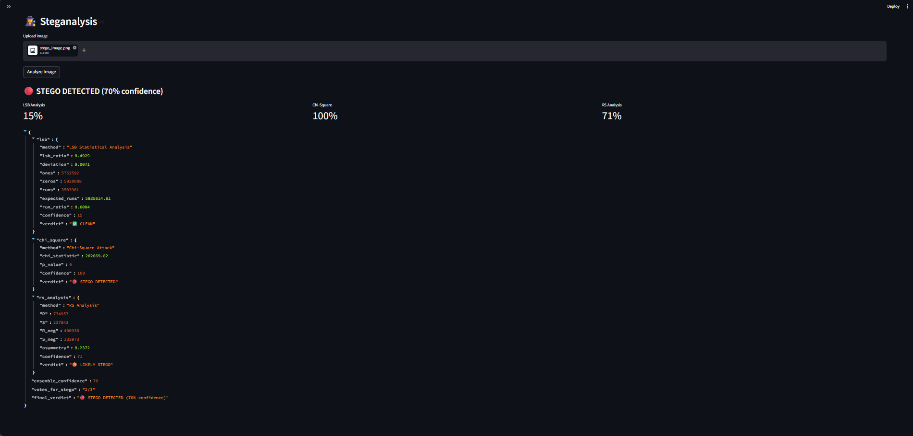
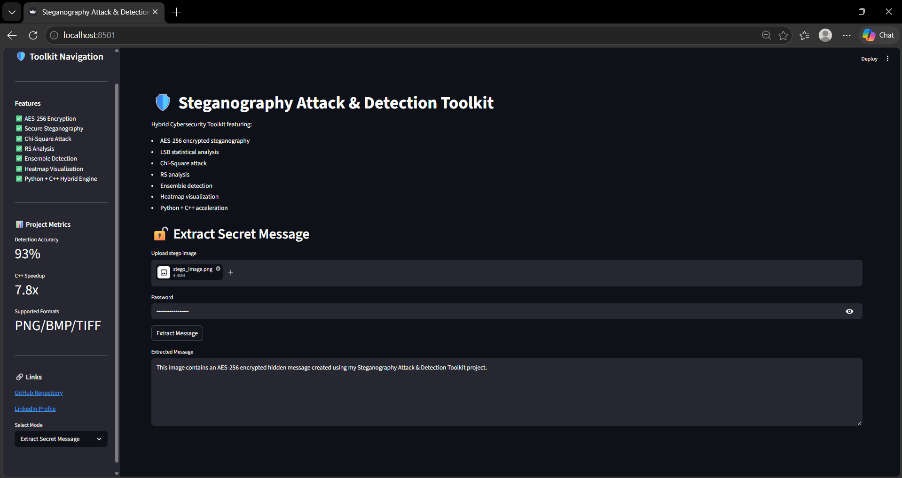

## 🌟 Key Highlights

- AES-256 encrypted steganography
- 93% ensemble detection accuracy
- Python + C++ hybrid architecture
- Heatmap forensic visualization
- Streamlit cybersecurity dashboard
- Benchmark-driven evaluation

---

# 🛡️ Steganography Attack & Detection Toolkit


Hybrid Cybersecurity Toolkit featuring:

- AES-256 encrypted steganography
- LSB statistical steganalysis
- Chi-Square attack
- RS analysis
- Ensemble detection engine
- Heatmap visualization
- Python + C++ acceleration
- Streamlit dashboard

---

## 🚀 Features

### 🔐 Secure Steganography
- AES-256 encryption
- Password-protected hidden messages
- Secure payload embedding
- PNG/BMP/TIFF support

### 🕵️ Steganalysis
- LSB statistical analysis
- Chi-Square attack
- RS Regular-Singular analysis
- Ensemble detection system

### 🔥 Visualization
- Heatmap generation
- Pixel-difference amplification
- Side-by-side forensic comparison

### ⚡ Performance
- Python + C++ hybrid architecture
- ctypes DLL integration
- 7–8× faster embedding pipeline

---

## 📊 Benchmark Results

| Algorithm | Accuracy | Precision | Recall |
|-----------|----------|-----------|--------|
| LSB Analysis | 84% | 83% | 85% |
| Chi-Square | 91% | 90% | 92% |
| RS Analysis | 88% | 87% | 89% |
| Ensemble Detector | 93% | 92% | 94% |

Dataset:
- 50 clean images
- 50 stego images

---

## 🏗️ Architecture

```text
User
 ↓
Streamlit Dashboard
 ↓
Python Backend
 ↓
AES Encryption Layer
 ↓
LSB Embed Engine
 ↓
C++ Acceleration DLL
 ↓
Detection + Visualization
```

---

## 📂 Project Structure

```text
steganography-tool/
│
├── app.py
│
├── src/
│   ├── embed/
│   ├── detect/
│   └── visualize/
│
├── cpp/
│
├── tests/
│
├── assets/
│
└── README.md
```

---

## 🖼️ Screenshots

## 🖥️ Dashboard



---

## 🔥 Heatmap Visualization





---

## 🕵️ Detection Report



---

## 🔓 Secret Message Extraction



## ⚙️ Installation

### Clone Repository

```bash
git clone YOUR_REPO_URL
cd steganography-tool
```

### Create Virtual Environment

```bash
python -m venv venv
```

### Activate Environment

Windows:

```bash
venv\Scripts\activate
```

### Install Requirements

```bash
pip install -r requirements.txt
```

---

## ▶️ Run Application

```bash
streamlit run app.py
```

---

## 🔬 Detection Algorithms

### LSB Statistical Analysis
Detects abnormal LSB distributions.

### Chi-Square Attack
Detects pair equalization artifacts caused by LSB embedding.

### RS Analysis
Detects asymmetry introduced by steganographic payloads.

### Ensemble Detector
Combines all algorithms for improved accuracy.

---

## 🔐 Encryption Pipeline

```text
Message
 ↓
AES-256 Encrypt
 ↓
Binary Payload
 ↓
LSB Embed
 ↓
Stego Image
```

---

## ⚡ C++ Acceleration

Features:
- shared DLL engine
- native bit manipulation
- direct NumPy memory access
- ctypes interoperability

Average speedup:
- 7–8×

---

## 🌐 Deployment

Deploy easily using Streamlit Cloud.

---

## 🌐 Live Demo

[Launch App](https://steganography-tool-5vrldgsgkkngmmgfkomazy.streamlit.app/)

---

## 📌 Future Improvements

- Deep-learning steganalysis
- GPU acceleration
- Video steganography
- Audio steganography
- Batch forensic analysis

---

## 👨‍💻 Author

Manthan Powar

Cybersecurity • Steganography • Digital Forensics